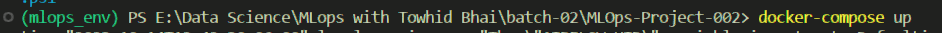
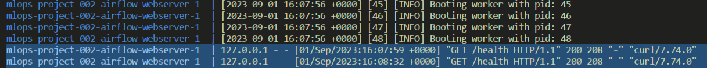
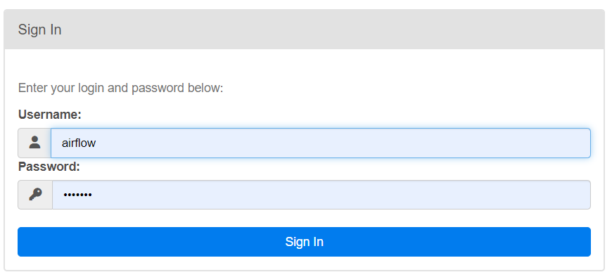
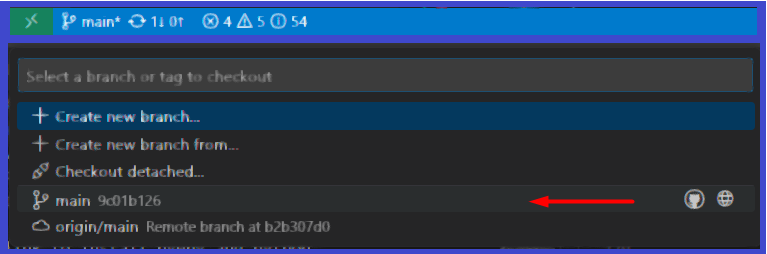

### 😺 Complete list of emoji Markup: 
https://gist.github.com/rxaviers/7360908

### 🐍 Environment Setup
1. Install vscode
2. Install Python pyenv 
3. Install python 3.8.6 using pyenv (Pyevn cheat sheet added below)
   >>video link to install pyenv and python
   ```sh
   https://www.youtube.com/watch?v=HTx18uyyHw8
   ```
   ```sh
   https://k0nze.dev/posts/install-pyenv-venv-vscode/
   ```
4. Activate it in powershell(vscode)
```sh
pyenv shell 3.8.6
```
5. 🎏 Install dependent extension in vscode
   ```sh
   1. DVC
   2. autoDocstring-Python
   3. autopep8 : formatting python official guideline
   4. Bracket Pair Colorization Togglers
   5. Dev Containers: can be replaced by docker
   6. Docker
   7.  Excel Viewer
   8.  Flake8 : works on python code writting style issue
   9.  Git History : Github history details
   10. IntelliCode : not mandatory
   11. IntelliCode API Usage Examples: not mandatory
   12. isort: python
   13. Jupyter
   14. Jupyter Cell Tags
   15. Jupyter Keymap
   16. Jupyter Notebook Renderers
   17. Jupyter Slide Show
   18. Markdown All in One
   19. Markdown Preview Enhanced
   20. Material Icon Theme: not mandatory
   21. Path Autocomplete
   22. Pylance
   23. Pylint
   24. Python
   25. Rainbow CSV
   26. Regex Previewer
   27. Remote-SSH: connects aws server /any cloud server and make it easier
   28. Remote-SSH: Editing Configuration File:
   29. Remote Explorer: 
   30. REST Client: unknown
   31. settings Sync: not explain: This extension is deprecated
   32. TODO Highlights: by Wayou Liu; add comments on code / future coarse of work
   33. Trailing Spaces: remove unnecessary space in code
   ```
### 💻Install Linux Env in windows and Docker Container
6. 🎏 Install wsl and run linux over windows operating system
   
   a. install Ubuntu 20.04.6 LTS
   >> :loudspeaker:  startmenu >> search >> Microsoft Store >> search >> Ubuntu 20.04.6 LTS >> install
   
   b. install wsl-2

   ```sh
   https://github.com/Shibli-Nomani/MLops---E2E/blob/main/week-03-06-wsl-Docker-ApcaheAirflow-DVC/w_04_05_install_Docker_and_Apache_Airflow_Data_Pipeline.ipynb

   ```
   c. software download: 
   ```sh 
   Download this WSL 2 kernel update (required). https://wslstorestorage.blob.core.windows.net/wslblob/wsl_update_x64.msi 
   ```
   d. command for windows command promopt for wsl 2 activation
   ```
   
    #wsl version and state
    wsl -l -v

    #set wsl version (wsl 1 to wsl 2)
    wsl --set-version Ubuntu-20.04 2

    #run wsl 2
    wsl -d Ubuntu-20.04 

    #shutdown wsl 2

    wsl --shutdown

   ```

7. 🎏 Install Docker  
   a. software download:
   ```sh
   https://docs.docker.com/docker-for-windows/install/ 
   ```
   b. installation process
   ```sh
   https://www.simplilearn.com/tutorials/docker-tutorial/install-docker-on-windows
   ```
   ```sh
   https://www.youtube.com/watch?v=XgRGI0Pw2mM
   ```
 ### 🌳Create Virtual Environment in vscode for MLOps Project  
8.  create virtual environment for the project under powershell
 optional: for create folder 
    ```
    #to create project directory
    mkdir MLOPS-PROJECT-002

    #install virtual env
    pip install virtualenv

    #create virtual env under project directory
    python -m venv mlops_env
    ````
    To activate virtual env in powershell(vscode)
    
    
    ```sh
    .\mlops_env\Scripts\activate
    ```
>> 👉  note: select python kernel  [View >> Command Palette >> Python(select interpreter) >> Python 3.8.6 (mlops_env: venv)]
### 💡 Exploratory Data Analysis and Install Dependent Libaries
9. Use vscode for EDA on Jypter Notebook and other project related work
10. 🎏 install requiered python libaries after activating the virtual env 

```
pip install scikit-learn
pip install xgboost
pip install catboost
others...
```
🎆or use and install listed libaries as per dependancy 
```sh
notebook_requirements.txt
```
powerhell command
```sh
pip install -r notebook_requirements.txt 
```
1.  Performing EDA and Model Bulding over Dataset in **notebook**
2.  👻 add .gitignore in project directory to ignore the files that you don't want to push in git
    
3.  to upload files / project in github
    >> a. Source Control >> select git repo >> commit
4.  apply git push under virtual env powershell for any new change


```sh
git pull
```
>> a. Source Control >> select git repo >> commit
[version name >> add Changes to Staged Changes]

```sh
git push
```


### 💻Docker Container and Apache Airflow


Docker is a platform for developing, shipping, and running applications in lightweight, portable containers, which package all the required dependencies and configurations.

Apache Airflow is an open-source platform designed for orchestrating, scheduling, and managing complex data workflows and data pipeline automation.

We use Docker for Apache Airflow in ML pipelines to ensure consistent and reproducible execution environments for data workflows and model training.

1.  Docker Installation as per previous instruction
```sh
https://docs.docker.com/docker-for-windows/install/ 

```

👉note: Need to install Docker + Docker Compose individually in case of Linux. Both install together in windows
12.  Add docker-compose.yaml for Apache Airflow
New File >> copy/paste docker-compose.yaml using following link👇
```sh
https://airflow.apache.org/docs/apache-airflow/2.6.3/docker-compose.yaml
```
####💥 customized  **docker-compose.yaml**
######❄️Pre-required steps
👉1. create **DockerFile** to run the image in docker-compose.yaml
```
file name should be DockerFile
```
👉2. create **requirement.txt** to run the image in docker-compose.yaml

To check the list of python version of different libaries[without virtual env]
```sh
pip freeze
```

```
👉3. docker-compose.yaml customization
a. create custom image
 build: 
  context: .
  dockerfile: ./DockerFile #new image


b. environment:
replace CeleryExecutor by LocalExecutor

c. volumes:

d. change the volumn directory
volumes:

 
    - ./dags:/opt/airflow/dags
    - ./logs:/opt/airflow/logs
    - ./config:/opt/airflow/config
    - ./plugins:/opt/airflow/plugins

💥 also remove redis from other section
f. Services:
remove redis
depends_on:
g. remove airflow-worker

👉note: Avoid unnecessary service and over consumption of memory and CPU by using **LocalExecutor**
```
13. create folder dags, logs, config, plugins under project directory
```sh
mkdir dags
```
```sh
mkdir logs
```
```sh
mkdir plugins
```
```sh
mkdir config
```

🌵 run below commands outside of virtual environment in powershell
 a. to de-activate virtual env in powershell
 ```sh
 deactivate
 ```
 🎆 initate Apache Airflow
 necessary command for powershell
```sh
docker-compose up airflow-init
```
🎆 run Apache Airflow inside docker
```sh
docker-compose up 
```
###  💡 Run Apache Airflow in Browser
😌 Apache Airflow is ready!!


```sh
http://localhost:8080/

```
Default user and pass
'''
user: airflow
pass: airflow
'''


14. Create test.py under dags folder to check the Apache Airflow pipeline performance
      
      ```

      🔨define Work Function

      🔨prepare dag

      🔨prepare task id 

      🔨assign task

      🔨define task function  

      🔨 task direction
      ```

🌵note: use Crontab guru to  set the date
```sh
https://crontab.guru/
```
<h4>😤 sometimes error generates for following issues </h4>
      
         a. python version mismatch in DockerFile and Virtual Env. Use proper version
   
         b. directory issues: dags, logs, plugins, config. Delete and Recreate
   
         c. click proper localhost for Apache Airflow

 ### ❄️Use dags to run python script in Apache Airflow
    a. import libaries
    b. define function and assign task
      '''
         👊here we create **airplane_price.py** inside dags for data_preprocessing and models(economy and business)as well as follow the process as like as **test.py**
      '''
    c. if you need additional libaries to install inside Docker, **following the setps

   😫Powershell commands
   To proceed the command, docker-compose must be up
```sh
docker ps
```
      
   Find the name of container and run bash to go inside docker container. here container name is `e87588ff2b07`
     
```sh
docker exec -it e87588ff2b07 /bin/bash
```
   🔥Install required libaries inside docker for apache airflow [if requires]
    
```sh
pip install xgboost
```
   Exit Container of Apache Airflow
    
```sh
exit
```
   To apply changes, stop and start Airflow Container (name = e87588ff2b07)

```sh
docker stop e87588ff2b07
```

```sh
docker start e87588ff2b07
```
### 🐍 Python Code Format Fixing Using Black
a. install black in powershell
```sh 
pip install black
```
b. select python dag directory to execute black
```sh
black .\dags\airplane_price.py
```
c. add docstring for developer understanding for each task. 😇

###🐠 DVC (For Data Version)

DVC is like Git but for data, helping you manage and version control your data files for machine learning projects.

👉note: no need to active virual env
   a. install git and DVC in desktop
   link: https://git-scm.com/downloads
   link: https://dvc.org/
   b. Install Git (related all necessary extension) and DVC extension in vscode
   c. Open project folder
   d. Go to powershell terminal
      🌟# write command to initiate git
```sh
git init
```
      🌟#initiate dvc
         #for data versioning and check the performance for any data version. old and new
         #access any version
         #we can work with git for data versioning. But there is a data store limitation 10GB.
```sh
dvc init
```
      
      🌟create a .gitignore file and write details what we don't need to push
      (igonre those files those you don't need to commit/don't push the data file to github)
      note: you don't need to create gitignore if it's already created

      🌟add data directory to dvc 
```sh
dvc add data/
```
      😤 note: ERROR:  output 'data' is already tracked by SCM (e.g. Git). You can remove it from Git, then add to DVC
      remove data directory from git
```sh
git rm -r --cached 'data'
```
git commit -m "stop tracking data"

      🌟now add data directory to dvc 
```sh
dvc add data/
```
      note: it will create a file data.dvc
```sh
dvc status
```
   powershell will suggest what to add for tracking with git
```sh
git add data.dvc .gitignore
```
### 📡 MLflow
MLflow is an open-source platform for managing the end-to-end machine learning lifecycle, including experimentation, reproducibility, and deployment. MLflow is a tool for tracking, managing, and deploying machine learning models.
Link: https://mlflow.org/

a. create Docker File for MLflow
b. to check mlflow version using powershell
```sh
pip freeze
```
✳️ c. add required lines in docker-compose.yaml file
```
environment:
    &airflow-common-env
    #AWS_ACCESS_KEY_ID: "your AWS_ACCESS_KEY_ID"
    #AWS_SECRET_ACCESS_KEY: "you AWS_SECRET_ACCESS_KEY"
    #AWS_BUCKET: t-airticket-bucket-v1
```
### 🌳 How to create IAM and Get Access Key
 
 about aws access key and iam : https://docs.aws.amazon.com/IAM/latest/UserGuide/id_credentials_access-keys.html

😅 select the main brach to upload any update in GitHub as we have created DVC for Data Version 


### Upcoming

