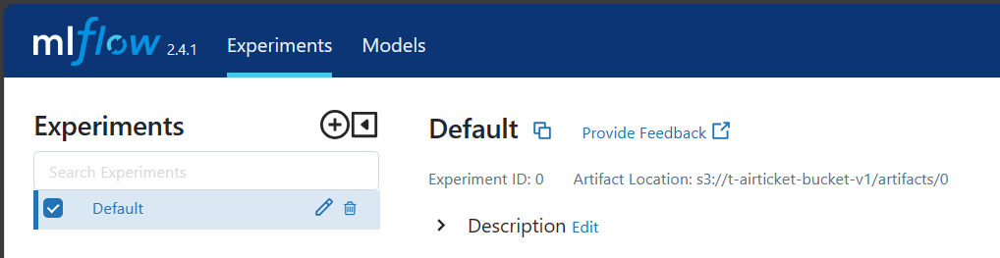

### 😺 Complete list of emoji Markup: 
https://gist.github.com/rxaviers/7360908

### 🐍 Environment Setup
1. Install vscode
2. Install Python pyenv 
3. Install python 3.8.6 using pyenv (Pyevn cheat sheet added below)
   >>video link to install pyenv and python
   ```sh
   https://www.youtube.com/watch?v=HTx18uyyHw8
   ```
   ```sh
   https://k0nze.dev/posts/install-pyenv-venv-vscode/
   ```
4. Activate it in powershell(vscode)
```sh
pyenv shell 3.8.6
```
5. 🎏 Install dependent extension in vscode
   ```sh
   1. DVC
   2. autoDocstring-Python
   3. autopep8 : formatting python official guideline
   4. Bracket Pair Colorization Togglers
   5. Dev Containers: can be replaced by docker
   6. Docker
   7.  Excel Viewer
   8.  Flake8 : works on python code writting style issue
   9.  Git History : Github history details
   10. IntelliCode : not mandatory
   11. IntelliCode API Usage Examples: not mandatory
   12. isort: python
   13. Jupyter
   14. Jupyter Cell Tags
   15. Jupyter Keymap
   16. Jupyter Notebook Renderers
   17. Jupyter Slide Show
   18. Markdown All in One
   19. Markdown Preview Enhanced
   20. Material Icon Theme: not mandatory
   21. Path Autocomplete
   22. Pylance
   23. Pylint
   24. Python
   25. Rainbow CSV
   26. Regex Previewer
   27. Remote-SSH: connects aws server /any cloud server and make it easier
   28. Remote-SSH: Editing Configuration File:
   29. Remote Explorer: 
   30. REST Client: unknown
   31. settings Sync: not explain: This extension is deprecated
   32. TODO Highlights: by Wayou Liu; add comments on code / future coarse of work
   33. Trailing Spaces: remove unnecessary space in code
   ```
### 💻Install Linux Env in windows and Docker Container
6. 🎏 Install wsl and run linux over windows operating system
   
   a. install Ubuntu 20.04.6 LTS
   >> :loudspeaker:  startmenu >> search >> Microsoft Store >> search >> Ubuntu 20.04.6 LTS >> install
   
   b. install wsl-2

   ```sh
   https://github.com/Shibli-Nomani/MLops---E2E/blob/main/week-03-06-wsl-Docker-ApcaheAirflow-DVC/w_04_05_install_Docker_and_Apache_Airflow_Data_Pipeline.ipynb

   ```
   c. software download: 
   ```sh 
   Download this WSL 2 kernel update (required). https://wslstorestorage.blob.core.windows.net/wslblob/wsl_update_x64.msi 
   ```
   d. command for windows command promopt for wsl 2 activation
   ```
   
    #wsl version and state
    wsl -l -v

    #set wsl version (wsl 1 to wsl 2)
    wsl --set-version Ubuntu-20.04 2

    #run wsl 2
    wsl -d Ubuntu-20.04 

    #shutdown wsl 2

    wsl --shutdown

   ```

7. 🎏 Install Docker  
   a. software download:
   ```sh
   https://docs.docker.com/docker-for-windows/install/ 
   ```
   b. installation process
   ```sh
   https://www.simplilearn.com/tutorials/docker-tutorial/install-docker-on-windows
   ```
   ```sh
   https://www.youtube.com/watch?v=XgRGI0Pw2mM
   ```
 ### 🌳Create Virtual Environment in vscode for MLOps Project  
8.  create virtual environment for the project under powershell
 optional: for create folder 
    ```
    #to create project directory
    mkdir MLOPS-PROJECT-002

    #install virtual env
    pip install virtualenv

    #create virtual env under project directory
    python -m venv mlops_env
    ````
    To activate virtual env in powershell(vscode)
    

    ```sh
    .\mlops_env\Scripts\activate
    ```
>> 👉  note: select python kernel  [View >> Command Palette >> Python(select interpreter) >> Python 3.8.6 (mlops_env: venv)]
### 💡 Exploratory Data Analysis and Install Dependent Libaries
9. Use vscode for EDA on Jypter Notebook and other project related work
10. 🎏 install requiered python libaries after activating the virtual env 

```
pip install scikit-learn
pip install xgboost
pip install catboost
others...
```
🎆or use and install listed libaries as per dependancy 
```sh
notebook_requirements.txt
```
powerhell command
```sh
pip install -r notebook_requirements.txt 
```
1.  Performing EDA and Model Bulding over Dataset in **notebook**
2.  👻 add .gitignore in project directory to ignore the files that you don't want to push in git
    
3.  to upload files / project in github
    >> a. Source Control >> select git repo >> commit
4.  apply git push under virtual env powershell for any new change


```sh
git pull
```
>> a. Source Control >> select git repo >> commit
[version name >> add Changes to Staged Changes]

```sh
git push
```


### 💻Docker Container and Apache Airflow


`Docker` is a platform for developing, shipping, and running applications in lightweight, portable containers, which package all the required dependencies and configurations. Docker Engine is the underlying technology that runs containers.

`Apache Airflow` is an open-source platform designed for orchestrating, scheduling, and managing complex data workflows and data pipeline automation.

We use Docker for Apache Airflow in ML pipelines to ensure consistent and reproducible execution environments for data workflows and model training.

1.  Docker Installation as per previous instruction
```sh
https://docs.docker.com/docker-for-windows/install/ 

```

👉note: Need to install Docker + Docker Compose individually in case of Linux. Both install together in windows
12.  Add docker-compose.yaml for Apache Airflow
New File >> copy/paste docker-compose.yaml using following link👇
```sh
https://airflow.apache.org/docs/apache-airflow/2.6.3/docker-compose.yaml
```
####💥 customized  **docker-compose.yaml**
######❄️Pre-required steps
👉1. create **DockerFile** to run the image in docker-compose.yaml
```
file name should be DockerFile
```
👉2. create **requirement.txt** to run the image in docker-compose.yaml

To check the list of python version of different libaries[without virtual env]
```sh
pip freeze
```

```
👉3. docker-compose.yaml customization
a. create custom image
 build: 
  context: .
  dockerfile: ./DockerFile #new image


b. environment:
replace CeleryExecutor by LocalExecutor

c. volumes:

d. change the volumn directory
volumes:

 
    - ./dags:/opt/airflow/dags
    - ./logs:/opt/airflow/logs
    - ./config:/opt/airflow/config
    - ./plugins:/opt/airflow/plugins

💥 also remove redis from other section
f. Services:
remove redis
depends_on:
g. remove airflow-worker

👉note: Avoid unnecessary service and over consumption of memory and CPU by using **LocalExecutor**
```
13. create folder dags, logs, config, plugins under project directory
```sh
mkdir dags
```
```sh
mkdir logs
```
```sh
mkdir plugins
```
```sh
mkdir config
```

🌵 run below commands outside of virtual environment in powershell
 a. to de-activate virtual env in powershell
 ```sh
 deactivate
 ```
 🎆 initate Apache Airflow
 necessary command for powershell
```sh
docker-compose up airflow-init
```
🎆 run Apache Airflow inside docker
```sh
docker-compose up 
```
###  💡 Run Apache Airflow in Browser
😌 Apache Airflow is ready!!


```sh
http://localhost:8080/

```
Default user and pass
'''
user: airflow
pass: airflow
'''


14. Create test.py under dags folder to check the Apache Airflow pipeline performance
      
      ```

      🔨define Work Function

      🔨prepare dag

      🔨prepare task id 

      🔨assign task

      🔨define task function  

      🔨 task direction
      ```

🌵note: use Crontab guru to  set the date
```sh
https://crontab.guru/
```
<h4>😤 sometimes error generates for following issues </h4>
      
         a. python version mismatch in DockerFile and Virtual Env. Use proper version
   
         b. directory issues: dags, logs, plugins, config. Delete and Recreate
   
         c. click proper localhost for Apache Airflow

 ### ❄️Use dags to run python script in Apache Airflow

    a. import libaries
    b. define function and assign task

      '''
         👊here we create **airplane_price.py** inside dags for data_preprocessing and models(economy and business)as well as follow the process as like as **test.py**
      '''
    c. if you need additional libaries to install inside Docker, **following the setps

   😫Powershell commands
   To proceed the command, docker-compose must be up
```sh
docker ps
```
      
   Find the name of container and run bash to go inside docker container. here container name is `e87588ff2b07`
     
```sh
docker exec -it e87588ff2b07 /bin/bash
```
   🔥Install required libaries inside docker for apache airflow [if requires]
    
```sh
pip install xgboost
```
   Exit Container of Apache Airflow
    
```sh
exit
```
   To apply changes, stop and start Airflow Container (name = e87588ff2b07)

```sh
docker stop e87588ff2b07
```

```sh
docker start e87588ff2b07
```
### 🐍 Python Code Format Fixing Using Black
a. install black in powershell
```sh 
pip install black
```
b. select python dag directory to execute black
```sh
black .\dags\airplane_price.py
```
c. add docstring for developer understanding for each task. 😇

### 🐠 DVC (For Data Version)

DVC is like Git but for data, helping you manage and version control your data files for machine learning projects.

👉note: no need to active virual env
   >> a. install git and DVC in desktop
   link: https://git-scm.com/downloads
   link: https://dvc.org/

   >> b. Install Git (related all necessary extension) and DVC extension in vscode

   >> c. Open project folder
   
   >> d. Go to powershell terminal
      
      🌟write command to initiate git

```sh
git init
```
      🌟#initiate dvc
         #for data versioning and check the performance for any data version. old and new
         #access any version
         #we can work with git for data versioning. But there is a data store limitation 10GB.
```sh
dvc init
```
      
      🌟create a .gitignore file and write details what we don't need to push
      (igonre those files those you don't need to commit/don't push the data file to github)
      note: you don't need to create gitignore if it's already created

      🌟add data directory to dvc 

```sh
dvc add data/
```
      😤 note: ERROR:  output 'data' is already tracked by SCM (e.g. Git). You can remove it from Git, then add to DVC
      remove data directory from git
      
```sh
git rm -r --cached 'data'
```
```sh 
git commit -m "stop tracking data"
```

      🌟now add data directory to dvc 
```sh
dvc add data/
```
      note: it will create a file data.dvc

```sh
dvc status
```
   powershell will suggest what to add for tracking with git

```sh
git add data.dvc .gitignore
```

👊 DVC Dataversion Switching Process

🐝 Changes value in data directory in raw_data(Clean_Dataset.csv)
>> original: 4,Vistara,UK-963,Delhi,Morning,zero,Morning,Mumbai,Economy,2.33,1,5955
>> changed: 4,Vistara,UK-963,Delhi,Morning,zero,Morning,Mumbai,Economy,3.33,1,7955

Is it change working ❓ 

```sh
dvc status
```
note: yes, modified: data

#add new version of data

```sh
dvc add data/
```

```sh
git add data.dvc
```
😎 note: md tokenization number will be changed with the change of new data. sample is
'''md5: 4d9c91336a48c7628e9fad91fb45b963.dir'''

🌟#excute git commit with new version name

👭Jumping from one version to another
#for initial version

```sh
git checkout Head~1
```

```sh
dvc checkout
```
or, 
🌟to choose/check specific version
>> go >> vscode >> source control(git) >> history >> click selected version 
>> most right find digits to copy(copy to hash clipboard)

#apply command in powershell[version you would like to check]

```sh
git checkout 6906c5b1fa6dc60b6f2269d0bd40dfd4f4cb6456(number changes as per version)
```

#checkout dvc as well

```sh
dvc checkout
```
note:
😅 select the main brach to upload any update in GitHub as we have created DVC for Data Version 


### 🌳 How to create IAM and Get Access Key in AWS

>> Top most right >> accounts >> Security Credentials >> Access keys >> Create access key
 
 about aws access key and iam : https://docs.aws.amazon.com/IAM/latest/UserGuide/id_credentials_access-keys.html

   1. It is always best practice to create IAM users for access key and avoid rootuser
   To use the JSON policy editor to create a policy for access key (IAM user)

   2. Create IAM users in root directory and add in-built rules
   
   3. To add access policy, go to permission section in IAM user

   4. IAM >> User >> Permission >> Permissions policies >> add permissions 

   5. Choose Create inline policy.
   
   6. Choose the JSON option.
   
   7. Type or paste a JSON policy document(for access key management for IAM user). For details about the IAM policy language, see IAM JSON policy reference.
   
   8. Now generate access key using AWS CLI.
      
      >>IAM >> Users >> Security credentials >> create acess key

   9.  Dowload and store the access file for future
   
💡note: we need aws IAM for S3-Backet to store our model in cloud for the purpose of deployment and mlflow

### 🌳 How to create S3-Bucket in AWS

    1.  use IAM user for creating S3 Bucket not root user
   
    2.  no EC2 requires
   
    3.  Amazon S3 >> create bucket >>

### 📡 MLflow
MLflow is an open-source platform for managing the end-to-end machine learning lifecycle, including experimentation, reproducibility, and deployment. MLflow is a tool for tracking, managing, and deploying machine learning models.
Link: https://mlflow.org/
We will use it for experiment tracking and model deployment

a. update requirement.txt with `mlflow` library.

b. to check mlflow version using powershell

```sh
pip freeze
```

c. create Docker-mlflow with necessary detials

d. create `run.sh` file execution. It will set environment, perpare the mlflow server 

e. update docker-compose.yaml

✳️ f. add required lines in docker-compose.yaml file to access `AWS S3-Bucket` to make it access as we store model in there.

```
environment:
    &airflow-common-env
    #AWS_ACCESS_KEY_ID: your AWS_ACCESS_KEY_ID
    #AWS_SECRET_ACCESS_KEY: you AWS_SECRET_ACCESS_KEY
    #AWS_BUCKET: your_S3-Bucket_Name_for_Model
```
f. e. add services for mlflow in docker-compose.yaml

g. go to dags >> airplane_price.py

h. import necessary libaries and codes for mlflow. now we need a host for mlflow tracking server `(can be cloud /in-premesis / docker)`. Here we use docker and add few line of code for hosting it in docker container. 

i. set tracking uri in that code for mlflow. here, we choose `port 5000` in `Docker-mlflow` file

```
global TRACKING_SERVER_HOST
mlflow.set_tracking_uri(f"http://{TRACKING_SERVER_HOST}:5000")
```
### 👽 Runnning MLFlow with Docker (without Apache Airflow)
this is a process to check the mlflow is working properly or not in Docker Container with Apache Airflow. Perform all of this outside of 👷 `virtual environment`

```sh
deactivate
```
a. firstly, stop the `Apache Airflow` running container.

powershell command:

>> to container ID for Apache Airflow Webserver

```sh
docker ps
```
>> to stop  container ID for Apache Airflow Webserver

```sh
docker stop CONTAINER ID
```
>> to start respective container

```sh
docker start CONTAINER ID
```

b. build the image of mlflow in doceker

```sh
docker build -t mlflow-server -f Docker-mlflow .
```
c. to run the mlflow server in docker container

```sh
docker run -p 5000:5000 -v mlflow:/mlflow mlflow-server

```
#for mlflow server: http://localhost:5000/



😏 note: sometimes you may face problem due to limited space in your drive of your pc. Therefore create space in your respective drive. 

### 🔓 Final Execution of Docker Containers for Apache-Airflow and MLFlow

a. stops all containers

b. remove all the containers from `Docker Desktop`

#Intialization

```sh
docker-compose up airflow-init
```
#Bulid Docker

```sh
docker-compose up

```
Issue: `/run.sh: 19: mlflow: not found` . check the run.sh and Docker File.

👇Output of Docker:


😓 Issue: ERROR - Failed to execute job 16 for task bsn_training_task (Cannot set a deleted experiment 'Business_exp' as the active experiment. You can restore the experiment, or permanently delete the experiment to create a new one.; 416)

😎Solution: delete both Experiments and Models if you need to re-run it with same experiment name and version name


😓Issue: Artifacts details coming from S3 not showing in MLFlow UI

solution : forget to add AWS access details in Docker File for mlflow
#aws access key details


   ```ENV AWS_ACCESS_KEY_ID= your aws access key id
   ENV AWS_SECRET_ACCESS_KEY= your aws access key```

😇 Project Work Summarization:

Apache Airflow has been used to prerform and train the model over there. And MLFlow has been used to taking the log of training.

### Evidently 
The open-source ML observability platform. It uses for ML Model Evaluation, Day to Day Prediction Status, Data Drifting, Model Drifting

Data Drifiting: Real-life data  changes over time due to user bahaviour/other  issue resulted change in distribution. To measure, how much data chages over time and impacts the model using evidently. 
Either we remove the data which causes problem or we need to re-trained the model with new sets to data.

a. add code in dags at `.py ` for evidently and also add new task for data drifting with required libraries

b. run `docker-compose`

```sh
docker-compose up
```
c. run respective dags in airflow

d. go to desktop >> project >> find report to open respective html file to view `evidently report`

😎 Note: To undo last git commit from vscode
source control >>


